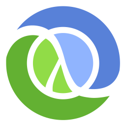
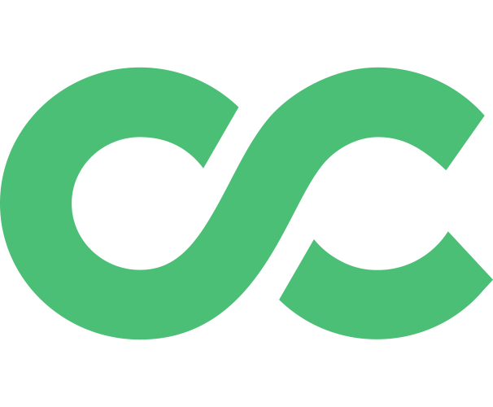

  <h1>Hi there 👋</h1>
  <!-- https://raw.githubusercontent.com/blackcater/blackcater/main/images/Hi.gif -->

<!--  -->

<!-- <picture>
  <source media="(prefers-color-scheme: dark)" srcset="src/old_man.gif">
  
</picture> -->

<!-- > I'm testing my profile page right now, WIP! -->

I greatly appreciate every contribution to my repositories: [explore](https://github.com/npanuhin?tab=repositories), create GitHub Issues, and submit Pull Requests! 😉

If my repository is _archived_, then I no longer maintain it. But you can still submit an issue [here](https://github.com/npanuhin/npanuhin/issues/new?template=questions-regarding-the-archived-repository.md) or [contact me directly](mailto:github@npanuhin.me?subject=Questions%20regarding%20the%20archived%20repository:%20<repository%20name%20here>) to ask a question.

**Active projects:**
     [Advent-of-Code](https://github.com/npanuhin/Advent-of-Code) — My elegant solutions to the captivating Advent of Code 🎄<!--  And some quirky surprises 😉 -->
     [Bing-Wallpaper-Archive](https://github.com/npanuhin/Bing-Wallpaper-Archive) — Comprehensive collection of stunning Bing daily wallpapers 🖼️ (WIP: v2)

<h3>Repository overview</h3>

**Ongoing projects:**
     [Artwork](https://github.com/npanuhin/Artwork) — My journey in 3D graphics, SVG drawing, and all things creative 🎨 (No recent updates)

**Archived projects:**
     [QuickPuTTY](https://github.com/npanuhin/QuickPuTTY) — Sublime Text plugin for PuTTY
     [Among-Us](https://github.com/npanuhin/Among-Us) — Among Us auto player

**ITMO University courses:**

📢 Please read if you are a student of ITMO University

> Use materials from educational repositories with caution!  
> Task statements are subject to change in the future. Understand the solution thoroughly before copying it.  
> Remember, you may be asked to explain your solution and thought process for the homework assignments, as well as respond to questions about the material during the exam.

       [ITMO-Algo](https://github.com/npanuhin/ITMO-Algo)<!-- 
        [ITMO-DM](https://github.com/npanuhin/ITMO-DM) -->
     <picture><source media="(prefers-color-scheme: dark)" srcset="src/icons/repos/Java.svg"><source media="(prefers-color-scheme: light)" srcset="src/icons/repos/Java.light.svg"></picture>   [ITMO-Java](https://github.com/npanuhin/ITMO-Java)
        [ITMO-paradigms](https://github.com/npanuhin/ITMO-paradigms)
        [ITMO-Verilog](https://github.com/npanuhin/ITMO-Verilog)
        [ITMO-Spectre](https://github.com/npanuhin/ITMO-Spectre)
        [ITMO-Elf-disassembler](https://github.com/npanuhin/ITMO-Elf-disassembler)
        [ITMO-PNM-autocontrast](https://github.com/npanuhin/ITMO-PNM-autocontrast)
        [ITMO-CPP-int128](https://github.com/npanuhin/ITMO-CPP-int128)
        [ITMO-CPP-8-puzzle](https://github.com/npanuhin/ITMO-CPP-8-puzzle)
        [ITMO-CPP-combinations](https://github.com/npanuhin/ITMO-CPP-combinations)
        [ITMO-CPP-lfru-multitype](https://github.com/npanuhin/ITMO-CPP-lfru-multitype)
        [ITMO-CPP-trees-scapegoat](https://github.com/npanuhin/ITMO-CPP-trees-scapegoat)
        [ITMO-CPP-ouch-enter-order](https://github.com/npanuhin/ITMO-CPP-ouch-enter-order)
        [ITMO-CPP-calc-number-system](https://github.com/npanuhin/ITMO-CPP-calc-number-system)

**[School projects:](https://github.com/npanuhin/school)**
        [NetSchool-PTHS](https://github.com/npanuhin/NetSchool-PTHS) — Website and main repo of NetSchool PTHS
        [NetSchool-parser](https://github.com/npanuhin/NetSchool-parser) — Data-collection tool/parser<!--  + [NetSchool-bot](https://github.com/npanuhin/NetSchool-bot) — Long deprecated VK-bot -->
        [BIOCAD](https://github.com/npanuhin/BIOCAD) + [BIOCAD-BWA](https://github.com/npanuhin/BIOCAD-BWA) — High school graduation project

> This is not a comprehensive listing of my projects — it showcases only the most notable ones.  
> I have numerous other repositories that serve different purposes, including data storage. While most of them are private, there are also several public ones which you can find [here](https://github.com/npanuhin?tab=repositories&sort=name)

 

<!-- Langbar?hide=Jupyter Notebook,npanuhin/Fourier:JavaScript&replace=Hack->PHP -->

  
  
  
  
  

<!------------------------ DEBUG ------------------------ DEBUG ------------------------ DEBUG ------------------------>

<!-- 

GitHub activity

1.  Commented on [#174](https://github.com/MadeBaruna/paimon-moe/issues/174#issuecomment-1011350380) in [MadeBaruna/paimon-moe](https://github.com/MadeBaruna/paimon-moe)
2.  Commented on [#187](https://github.com/MadeBaruna/paimon-moe/issues/187#issuecomment-1011348117) in [MadeBaruna/paimon-moe](https://github.com/MadeBaruna/paimon-moe)
3.  Commented on [#194](https://github.com/MadeBaruna/paimon-moe/issues/194#issuecomment-1011344088) in [MadeBaruna/paimon-moe](https://github.com/MadeBaruna/paimon-moe)
4. 
5. 
6. 
7. 

 -->

<!-- ᴼᶠᶠᶦᶜᶦᵃˡ -->

<!-- <kbd><samp>fastest</samp></kbd>                    <kbd><samp>official</samp></kbd>
 -->

<!-- For testing icons -->
<!--  Commented on {ID} in {REPO}'

 Opened issue {ID} in {REPO}'

 Closed issue {ID} in {REPO}'

 Opened PR {ID} in {REPO}'

 Closed PR {ID} in {REPO}'

 Merged PR {ID} in {REPO}'

 Created new repository {REPO}'

 Forked {FORK} from {REPO}'

 Created new wiki page {WIKI} in {REPO}'

 Became collaborator on {REPO}'

 Approved {ID} in {REPO}'

 Requested changes in {ID} in {REPO}'

 Released {ID} in {REPO}'

 Starred {REPO}' -->

<!-- https://github-readme-stats.vercel.app/api/pin/?username=npanuhin&repo=BIOCAD&theme=github_dark&bg_color=transparent -->

<!--
**npanuhin/npanuhin** is a ✨ _special_ ✨ repository because its `README.md` (this file) appears on your GitHub profile.

Here are some ideas to get you started:

- 🔭 I’m currently working on ...
- 🌱 I’m currently learning ...
- 👯 I’m looking to collaborate on ...
- 🤔 I’m looking for help with ...
- 💬 Ask me about ...
- 📫 How to reach me: ...
- 😄 Pronouns: ...
- ⚡ Fun fact: ...
-->
