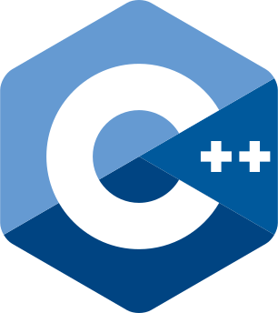
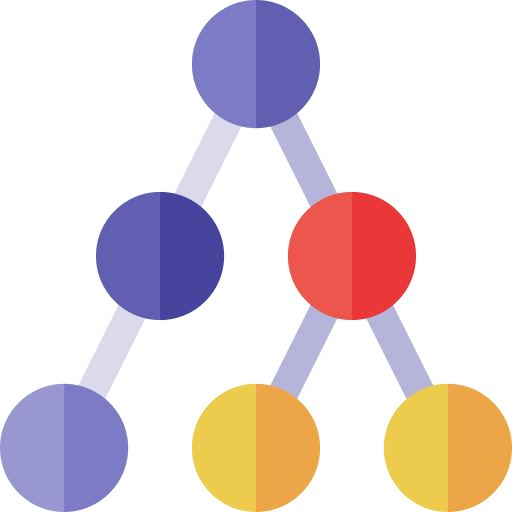
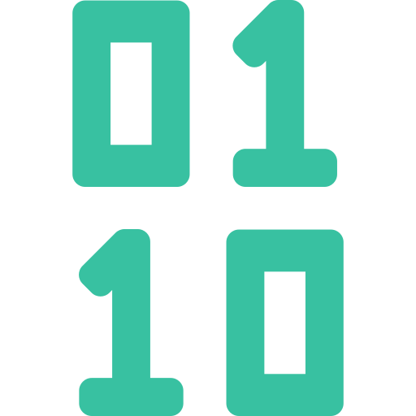
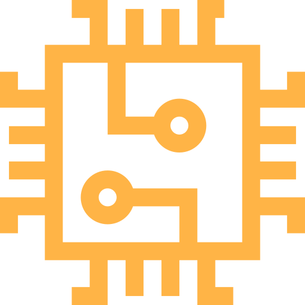
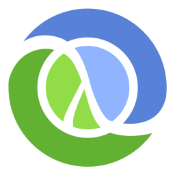
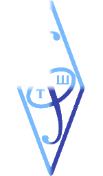

  <h1>Hi there 👋</h1>
  <!-- <h1>Hi there </h1> -->

<!--  -->

<!-- <picture>
  <source media="(prefers-color-scheme: dark)" srcset="src/old_man.gif">
  
</picture> -->

<!-- > I'm testing my profile page right now, WIP! -->

I greatly appreciate every contribution to my repositories: [explore](?tab=repositories), create GitHub Issues, and submit Pull Requests! 😉

If my repository is _archived_, then I no longer maintain it. But you can still submit an issue [here](https://github.com/npanuhin/npanuhin/issues/new?template=questions-regarding-the-archived-repository.md) or [contact me directly](mailto:github@npanuhin.me?subject=Questions%20regarding%20the%20archived%20repository:%20<repository%20name%20here>) to ask a question.

<!-- 

<h3>Repository listing</h3>
 -->

<!-- **University courses:**
 &nbsp;&nbsp;&nbsp;&nbsp;   [ITMO-CPP-lfru-multitype](ITMO-CPP-lfru-multitype)
 &nbsp;&nbsp;&nbsp;&nbsp;   [ITMO-CPP-trees-scapegoat](ITMO-CPP-trees-scapegoat)
 &nbsp;&nbsp;&nbsp;&nbsp;   [ITMO-CPP-ouch-enter-order](ITMO-CPP-ouch-enter-order)
 &nbsp;&nbsp;&nbsp;&nbsp;   [ITMO-CPP-calc-number-system](ITMO-CPP-calc-number-system)
 &nbsp;&nbsp;&nbsp;&nbsp;   [ITMO-Algo](ITMO-Algo)
 &nbsp;&nbsp;&nbsp;&nbsp;   [ITMO-DM](ITMO-DM)
 &nbsp;&nbsp;&nbsp;&nbsp;   [ITMO-Spectre](ITMO-Spectre)
 &nbsp;&nbsp;&nbsp;&nbsp;   [ITMO-PNM-autocontrast](ITMO-PNM-autocontrast)
 &nbsp;&nbsp;&nbsp;&nbsp;   [ITMO-Elf-disassembler](ITMO-Elf-disassembler)
 &nbsp;&nbsp;&nbsp;&nbsp;   [ITMO-Verilog](ITMO-Verilog)
 &nbsp;&nbsp;&nbsp;&nbsp;   [ITMO-paradigms](ITMO-paradigms)
 &nbsp;&nbsp;&nbsp;&nbsp;<a href="ITMO-Java"><picture><source media="(prefers-color-scheme: dark)" srcset="src/icons/Java.svg"><source media="(prefers-color-scheme: light)" srcset="src/icons/Java.light.svg"></picture></a>   [ITMO-Java](ITMO-Java)

**[School projects:](school)**
 &nbsp;&nbsp;&nbsp;&nbsp;   [NetSchool-PTHS](NetSchool-PTHS) — Website and main repo
 &nbsp;&nbsp;&nbsp;&nbsp;   [NetSchool-parser](NetSchool-parser) — Data-collection tool/parser
 -->
<!-- 
 -->

 

<!-- Langbar?hide=Jupyter Notebook,npanuhin/Fourier:JavaScript&replace=Hack->PHP -->

<!-- Activity graph -->
<!--  -->

<!-- 

GitHub activity

1.  Commented on [#174](https://github.com/MadeBaruna/paimon-moe/issues/174#issuecomment-1011350380) in [MadeBaruna/paimon-moe](https://github.com/MadeBaruna/paimon-moe)
2.  Commented on [#187](https://github.com/MadeBaruna/paimon-moe/issues/187#issuecomment-1011348117) in [MadeBaruna/paimon-moe](https://github.com/MadeBaruna/paimon-moe)
3.  Commented on [#194](https://github.com/MadeBaruna/paimon-moe/issues/194#issuecomment-1011344088) in [MadeBaruna/paimon-moe](https://github.com/MadeBaruna/paimon-moe)
4. 
5. 
6. 
7. 

 -->

  
  
  
  
  

  <!-- ᴼᶠᶠᶦᶜᶦᵃˡ -->

<!-- <kbd><samp>fastest</samp></kbd>                    <kbd><samp>official</samp></kbd>
 -->

<!----------------------- DEBUG ------------------------- DEBUG ------------------- DEBUG ----------------------------->

<!-- For testing icons -->
<!--  Commented on {ID} in {REPO}'

 Opened issue {ID} in {REPO}'

 Closed issue {ID} in {REPO}'

 Opened PR {ID} in {REPO}'

 Closed PR {ID} in {REPO}'

 Merged PR {ID} in {REPO}'

 Created new repository {REPO}'

 Forked {FORK} from {REPO}'

 Created new wiki page {WIKI} in {REPO}'

 Became collaborator on {REPO}'

 Approved {ID} in {REPO}'

 Requested changes in {ID} in {REPO}'

 Released {ID} in {REPO}'

 Starred {REPO}' -->

<!-- https://github-readme-stats.vercel.app/api/pin/?username=npanuhin&repo=BIOCAD&theme=github_dark&bg_color=transparent -->

<!--
**npanuhin/npanuhin** is a ✨ _special_ ✨ repository because its `README.md` (this file) appears on your GitHub profile.

Here are some ideas to get you started:

- 🔭 I’m currently working on ...
- 🌱 I’m currently learning ...
- 👯 I’m looking to collaborate on ...
- 🤔 I’m looking for help with ...
- 💬 Ask me about ...
- 📫 How to reach me: ...
- 😄 Pronouns: ...
- ⚡ Fun fact: ...
-->
