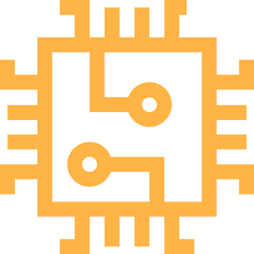
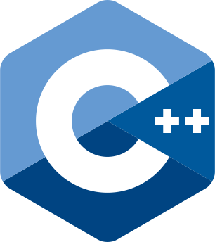
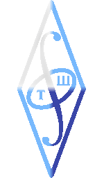

  <h1>Hi there 👋</h1>
  <!-- https://raw.githubusercontent.com/blackcater/blackcater/main/images/Hi.gif -->

<!-- 
<picture>
  <source media="(prefers-color-scheme: dark)" srcset="src/old_man.gif">
  
</picture>
 -->

<!-- > I'm testing my profile page right now, WIP! -->

I greatly appreciate every contribution to my repositories: [explore](https://github.com/npanuhin?tab=repositories), create GitHub Issues, and submit Pull Requests! 😉

If my repository is _archived_, then I no longer maintain it. But you can still submit an issue [here](https://github.com/npanuhin/npanuhin/issues/new?template=questions-regarding-the-archived-repository.md) or [contact me directly](mailto:github@npanuhin.me?subject=Questions%20regarding%20the%20archived%20repository:%20<repository%20name%20here>) to ask a question.

**Active projects:**
     [Bing-Wallpaper-Archive](https://github.com/npanuhin/Bing-Wallpaper-Archive) — Most comprehensive and easy-to-use collection of Bing daily wallpapers 🖼️

<b>Repository overview</b>
 

**Semi-archived projects:**
     [Advent-of-Code](https://github.com/npanuhin/Advent-of-Code) — My elegant solutions to the captivating Advent of Code 🎄<!--  And some quirky surprises 😉 -->
     [Artwork](https://github.com/npanuhin/Artwork) — My journey in 3D graphics, SVG drawing, and all things creative 🨠(No recent updates)

**Past work collection:**
     [Among-Us](https://github.com/npanuhin/Among-Us) — Among Us auto player
     [QuickPuTTY](https://github.com/npanuhin/QuickPuTTY) — Sublime Text plugin for PuTTY
     [Kyrgyz Keyboard](https://github.com/Kyrgyz-Keyboard) — Kyrgyz Keyboard for Android (backend part)

**Constructor University courses:**

📢 Please read if you are a student of Constructor University

> Use materials from educational repositories with caution! 
> Task statements are subject to change in the future. Understand the solution thoroughly before copying it. 
> Remember, you may be asked to explain your solution and thought process for the homework assignments, as well as respond to questions about the material during the exam.

       [CU-Databases](https://github.com/npanuhin/CU-Databases)
        [CU-System-Design](https://github.com/npanuhin/CU-System-Design)
        [CU-Computer-Architecture](https://github.com/npanuhin/CU-Computer-Architecture)
        [CU-Functional-Programming](https://github.com/npanuhin/CU-Functional-Programming)
        [CU-Kotlin-Tower-of-Hanoi](https://github.com/npanuhin/CU-Kotlin-Tower-of-Hanoi)
        [CU-Kotlin-Coroutines-course](https://github.com/npanuhin/CU-Kotlin-Coroutines-course)
        [CU-Kotlin-Collections-course](https://github.com/npanuhin/CU-Kotlin-Collections-course)
        [CU-Kotlin-Introduction-course](https://github.com/npanuhin/CU-Kotlin-Introduction-course)
        [CU-Kotlin-IDE-Code-Refactoring-course](https://github.com/npanuhin/CU-Kotlin-IDE-Code-Refactoring-course)
        [CU-Kotlin-Object-Oriented-Programming-course](https://github.com/npanuhin/CU-Kotlin-Object-Oriented-Programming-course)
        [CU-Advanced-Algo-Parallel-Programming-Practice](https://github.com/npanuhin/CU-Advanced-Algo-Parallel-Programming-Practice)
     TBA: other courses

**ITMO University courses:**

📢 Please read if you are a student of ITMO University

> Use materials from educational repositories with caution! 
> Task statements are subject to change in the future. Understand the solution thoroughly before copying it. 
> Remember, you may be asked to explain your solution and thought process for the homework assignments, as well as respond to questions about the material during the exam.

       [ITMO-Algo](https://github.com/npanuhin/ITMO-Algo)<!--
        [ITMO-DM](https://github.com/npanuhin/ITMO-DM) -->
     <picture><source media="(prefers-color-scheme: dark)" srcset="src/icons/repos/Java.svg"><source media="(prefers-color-scheme: light)" srcset="src/icons/repos/Java.light.svg"></picture>   [ITMO-Java](https://github.com/npanuhin/ITMO-Java)
        [ITMO-paradigms](https://github.com/npanuhin/ITMO-paradigms)
        [ITMO-Verilog](https://github.com/npanuhin/ITMO-Verilog)
        [ITMO-Spectre](https://github.com/npanuhin/ITMO-Spectre)
        [ITMO-Elf-disassembler](https://github.com/npanuhin/ITMO-Elf-disassembler)
        [ITMO-PNM-autocontrast](https://github.com/npanuhin/ITMO-PNM-autocontrast)
        [ITMO-CPP-int128](https://github.com/npanuhin/ITMO-CPP-int128)
        [ITMO-CPP-8-puzzle](https://github.com/npanuhin/ITMO-CPP-8-puzzle)
        [ITMO-CPP-combinations](https://github.com/npanuhin/ITMO-CPP-combinations)
        [ITMO-CPP-lfru-multitype](https://github.com/npanuhin/ITMO-CPP-lfru-multitype)
        [ITMO-CPP-trees-scapegoat](https://github.com/npanuhin/ITMO-CPP-trees-scapegoat)
        [ITMO-CPP-ouch-enter-order](https://github.com/npanuhin/ITMO-CPP-ouch-enter-order)
        [ITMO-CPP-calc-number-system](https://github.com/npanuhin/ITMO-CPP-calc-number-system)

**[School projects:](https://github.com/npanuhin/school)**
        [NetSchool-PTHS](https://github.com/npanuhin/NetSchool-PTHS) — Website and main repo of NetSchool PTHS
        [NetSchool-parser](https://github.com/npanuhin/NetSchool-parser) — Data-collection tool/parser<!--  + [NetSchool-bot](https://github.com/npanuhin/NetSchool-bot) — Long deprecated VK-bot -->
        [BIOCAD](https://github.com/npanuhin/BIOCAD) + [BIOCAD-BWA](https://github.com/npanuhin/BIOCAD-BWA) — High school graduation project

**Educational projects:** 
Projects with the name `edu-...` are created for one-time use, for example, to submit an assignment or demonstrate some small project (e.g. for an interview). They will not be updated or maintained and will be archived shortly after creation.

> This is not a comprehensive listing of my projects — it showcases only the most notable ones. 
> I have numerous other repositories that serve different purposes, including data storage. While most of them are private, there are also several public ones which you can find [here](https://github.com/npanuhin?tab=repositories&sort=name)

 

<!-- Langbar?hide=Jupyter Notebook,npanuhin/Fourier:JavaScript&replace=Hack->PHP -->

 <!--  [![](https://img.shields.io/badge/Telegram［FASTEST］-2CA5E0?style=for-the-badge&logo=data%3Aimage%2Fsvg%2Bxml%3Bbase64%2CPHN2ZyB4bWxucz0iaHR0cDovL3d3dy53My5vcmcvMjAwMC9zdmciIHZpZXdCb3g9IjAgMCAxMDAgMTAwIj48Y2lyY2xlIGN4PSI1MCIgY3k9IjUwIiByPSI1MCIgZmlsbD0iI0ZGRiIvPjxwYXRoIGQ9Ik0yMi42MzMgNDkuNDcyYzE0LjU3Ni02LjM1MSAyNC4yOTYtMTAuNTM3IDI5LjE1OS0xMi41NiAxMy44ODYtNS43NzUgMTYuNzcxLTYuNzc5IDE4LjY1MS02LjgxMi40MTQtLjAwNyAxLjMzOC4wOTUgMS45MzguNTgxLjUwNi40MS42NDUuOTY1LjcxMiAxLjM1NHMuMTUgMS4yNzYuMDg0IDEuOTY4Yy0uNzUyIDcuOTA2LTQuMDA4IDI3LjA5Mi01LjY2NSAzNS45NDctLjcwMSAzLjc0Ny0yLjA4MSA1LjAwMy0zLjQxNyA1LjEyNi0yLjkwNC4yNjctNS4xMDgtMS45MTktNy45MjEtMy43NjItNC40MDEtMi44ODUtNi44ODctNC42OC0xMS4xNTgtNy40OTUtNC45MzctMy4yNTMtMS43MzYtNS4wNDEgMS4wNzctNy45NjMuNzM2LS43NjUgMTMuNTMtMTIuNDAxIDEzLjc3Ny0xMy40NTcuMDMxLS4xMzIuMDYtLjYyNC0uMjMzLS44ODRzLS43MjQtLjE3MS0xLjAzNS0uMWMtLjQ0MS4xLTcuNDcxIDQuNzQ3LTIxLjA5IDEzLjk0LTEuOTk1IDEuMzctMy44MDMgMi4wMzgtNS40MjIgMi4wMDMtMS43ODUtLjAzOS01LjIxOS0xLjAwOS03Ljc3Mi0xLjgzOS0zLjEzMS0xLjAxOC01LjYyLTEuNTU2LTUuNDAzLTMuMjg1LjExMy0uOSAxLjM1My0xLjgyMSAzLjcyLTIuNzYyWiIgZmlsbD0iIzI2QTVFNCIvPjwvc3ZnPg%3D%3D)](https://t.me/npanuhin)
  
  [![](https://img.shields.io/badge/Discord-5865F2?style=for-the-badge&logo=data%3Aimage%2Fsvg%2Bxml%3Bbase64%2CPHN2ZyB4bWxucz0iaHR0cDovL3d3dy53My5vcmcvMjAwMC9zdmciIHZpZXdCb3g9IjAgMCAxMzEuOTIxIDEwMCI%2BCiAgPHBhdGggZmlsbD0iI0ZGRiIgZD0iTTg0LjUzMSAwYTc2Ljg1MiA3Ni44NTIgMCAwIDAtMy40OTkgNy4wNzcgMTAxLjkyIDEwMS45MiAwIDAgMC0zMC4yMDMgMEE3MC43NjQgNzAuNzY0IDAgMCAwIDQ3LjMzIDAgMTA5Ljk4MiAxMDkuOTgyIDAgMCAwIDIwLjEgOC4zOTJDMi44OTUgMzMuODg2LTEuNzYyIDU4LjcyMS41NTMgODMuMjE1YTEwOS40MzIgMTA5LjQzMiAwIDAgMCAzMy4zODYgMTYuNzU5IDgwLjEyIDgwLjEyIDAgMCAwIDcuMTU2LTExLjUyM2MtMy44OTQtMS40NDctNy42NTYtMy4yNjItMTEuMjYtNS4zNjcuOTQ3LS42ODQgMS44NjgtMS4zOTQgMi43NjItMi4wNzhhNzguMzkgNzguMzkgMCAwIDAgNjYuNzQ2IDAgMzQuMTg0IDM0LjE4NCAwIDAgMCAyLjc2MiAyLjA3OCA3MS41ODQgNzEuNTg0IDAgMCAxLTExLjI4NiA1LjM5M0E4MC4wNjUgODAuMDY1IDAgMCAwIDk3Ljk3NSAxMDBhMTA5LjM3MyAxMDkuMzczIDAgMCAwIDMzLjM4Ni0xNi43MzJjMi43MzUtMjguNDE0LTQuNjgzLTUzLjAzOS0xOS42MDEtNzQuODQ5QTEwOC4yMSAxMDguMjEgMCAwIDAgODQuNTU4LjA1M0w4NC41MzIgMFpNNDQuMDQyIDY4LjE0Yy02LjQ5OCAwLTExLjg5Mi01Ljg5My0xMS44OTItMTMuMTgxczUuMTgzLTEzLjIwNyAxMS44NjUtMTMuMjA3IDExLjk5NyA1Ljk0NiAxMS44OTIgMTMuMjA3Yy0uMTA1IDcuMjYxLTUuMjM1IDEzLjE4MS0xMS44NjUgMTMuMTgxWm00My44MzEgMGMtNi41MjUgMC0xMS44NjUtNS44OTMtMTEuODY1LTEzLjE4MXM1LjE4My0xMy4yMDcgMTEuODY1LTEzLjIwNyAxMS45NzEgNS45NDYgMTEuODY1IDEzLjIwN2MtLjEwNSA3LjI2MS01LjIzNSAxMy4xODEtMTEuODY1IDEzLjE4MVoiLz4KPC9zdmc%2BCg%3D%3D)](https://discord.com/users/532989319481393183)
   -->
  <!-- [![](https://img.shields.io/badge/Email%EF%BC%BBOFFICIAL%EF%BC%BD-C71610?style=for-the-badge&logo=data%3Aimage%2Fsvg%2Bxml%3Bbase64%2CPHN2ZyB4bWxucz0iaHR0cDovL3d3dy53My5vcmcvMjAwMC9zdmciIHZpZXdCb3g9IjAgMCAxMDAgMTAwIj4KICA8cGF0aCBmaWxsPSIjRkZGIiBkPSJNNTAgMGMyNy41NTMgMCA1MCAyMi40NDcgNTAgNTAgMCAxNy4xNjUtOC4wMTEgMjUuMjY0LTE4LjEzNCAyNS4yNjQtNS44OTggMC0xMS4wMDQtMy4wODEtMTMuOTA4LTcuNjU5LTQuNTc4IDQuNjY2LTEwLjkxNiA3LjU3LTE3Ljk1OCA3LjU3LTEzLjkwOCAwLTI1LjE3Ni0xMS4yNjgtMjUuMTc2LTI1LjE3NlMzNi4wOTIgMjQuODIzIDUwIDI0LjgyM3MyNS4xNzYgMTEuMjY4IDI1LjE3NiAyNS4xNzZ2OC4xODdjMCA0LjEzNyAyLjkwNSA3LjA0MiA2LjY5IDcuMDQyIDQuNDg5IDAgOC4xODctMy43ODUgOC4xODctMTUuMjI5QzkwLjA1MyAyNy45MDQgNzIuMDk1IDkuOTQ2IDUwIDkuOTQ2UzkuOTQ3IDI3LjkwNSA5Ljk0NyA1MCAyNy45MDUgOTAuMDUzIDUwIDkwLjA1M2MxMi43NjQgMCAyMS41NjctNi4zMzggMjEuNTY3LTYuMzM4bDYuNjAyIDcuNTdTNjYuOTAyIDEwMCA1MCAxMDBDMjIuNDQ3IDEwMCAwIDc3LjU1MyAwIDUwUzIyLjQ0NyAwIDUwIDBaTTM0Ljc3MSA1MGMwIDguMzYzIDYuNzc4IDE1LjIyOSAxNS4yMjkgMTUuMjI5IDguMzYzIDAgMTUuMjI5LTYuODY2IDE1LjIyOS0xNS4yMjkgMC04LjQ1MS02Ljg2Ni0xNS4yMjktMTUuMjI5LTE1LjIyOUExNS4xNzggMTUuMTc4IDAgMCAwIDM0Ljc3MSA1MFoiLz4KPC9zdmc%2BCg%3D%3D)](mailto:inbox@npanuhin.me) -->

  
   
  
   
  
   
  
   
  
   
  

<!------------------------ DEBUG ------------------------ DEBUG ------------------------ DEBUG ------------------------>

<!-- 

GitHub activity

1.  Commented on [#174](https://github.com/MadeBaruna/paimon-moe/issues/174#issuecomment-1011350380) in [MadeBaruna/paimon-moe](https://github.com/MadeBaruna/paimon-moe)
2.  Commented on [#187](https://github.com/MadeBaruna/paimon-moe/issues/187#issuecomment-1011348117) in [MadeBaruna/paimon-moe](https://github.com/MadeBaruna/paimon-moe)
3.  Commented on [#194](https://github.com/MadeBaruna/paimon-moe/issues/194#issuecomment-1011344088) in [MadeBaruna/paimon-moe](https://github.com/MadeBaruna/paimon-moe)
4. 
5. 
6. 
7. 

 -->

<!-- ᴼᶠᶠᶦᶜᶦᵃˡ -->

<!-- <kbd><samp>fastest</samp></kbd>                    <kbd><samp>official</samp></kbd>
 -->

<!-- For testing icons -->
<!--  Commented on {ID} in {REPO}'

 Opened issue {ID} in {REPO}'

 Closed issue {ID} in {REPO}'

 Opened PR {ID} in {REPO}'

 Closed PR {ID} in {REPO}'

 Merged PR {ID} in {REPO}'

 Created new repository {REPO}'

 Forked {FORK} from {REPO}'

 Created new wiki page {WIKI} in {REPO}'

 Became collaborator on {REPO}'

 Approved {ID} in {REPO}'

 Requested changes in {ID} in {REPO}'

 Released {ID} in {REPO}'

 Starred {REPO}' -->

<!-- https://github-readme-stats.vercel.app/api/pin/?username=npanuhin&repo=BIOCAD&theme=github_dark&bg_color=transparent -->

<!--
**npanuhin/npanuhin** is a ✨ _special_ ✨ repository because its `README.md` (this file) appears on your GitHub profile.

Here are some ideas to get you started:

- 🔭 I’m currently working on ...
- 🌱 I’m currently learning ...
- 👯 I’m looking to collaborate on ...
- 🤔 I’m looking for help with ...
- 💬 Ask me about ...
- 📫 How to reach me: ...
- 😄 Pronouns: ...
- ⚡ Fun fact: ...
-->
